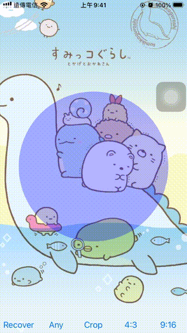

# WWCropViewController
[](https://developer.apple.com/swift/) [](https://developer.apple.com/swift/)  [](https://developer.apple.com/swift/) [](https://developer.apple.com/swift/)

### [Introduction - 簡介](https://swiftpackageindex.com/William-Weng)
- Crop picture widget.
- 裁切圖片小工具.



### [Installation with Swift Package Manager](https://medium.com/彼得潘的-swift-ios-app-開發問題解答集/使用-spm-安裝第三方套件-xcode-11-新功能-2c4ffcf85b4b)
```bash
dependencies: [
    .package(url: "https://github.com/William-Weng/WWCropViewController.git", .upToNextMajor(from: "1.1.0"))
]
```

### Function - 可用函式
|函式|功能|
|-|-|
|initSetting(cropViewType:angleZoomViewImages:cropViewBackgroundColor:)|初始化設定|
|build()|建立WWCropViewController|
|cropPhoto()|裁切圖片|
|cropViewTypeSetting(_:)|設定縮放框比例 / 種類 (1:1 / 4:3 / 16:9)|
|recoverOriginalPhoto()|還原成一開始的照片|
|updateCropViewBackgroundColor(_:)|設定縮放框的底色|
|angleImagesSetting(_:)|設定縮放的四角圖示 (↖左上 / ↗右上 / ↙左下 / ↘右下)|

### Example
```swift
final class ViewController: UIViewController {
    
    @IBOutlet weak var containerView: UIView!
    
    private let angleZoomViewImages: [UIImage] = ([#imageLiteral(resourceName: "Angle_LeftTop"), #imageLiteral(resourceName: "Angle_RightTop"), #imageLiteral(resourceName: "Angle_LefttBottom"), #imageLiteral(resourceName: "Angle_RightBottom")])
    
    private var cropViewController: WWCropViewController?

    override func viewDidLoad() {
        super.viewDidLoad()
        containerViewSetting()
    }
    
    @IBAction func cropPhotoAction(_ sender: UIButton) {
        _ = cropViewController?.cropPhoto()
        wwPrint(cropViewController?.photo)
    }
    
    @IBAction func recoverPhotoAction(_ sender: UIButton) { _ = cropViewController?.recoverOriginalPhoto() }
    @IBAction func cropViewTypeAction1(_ sender: UIButton) { cropViewController?.cropViewTypeSetting(.rectangle) }
    @IBAction func cropViewTypeAction2(_ sender: UIButton) { cropViewController?.cropViewTypeSetting(.scaleRectangle(.to4_3)) }
    @IBAction func cropViewTypeAction3(_ sender: UIButton) { cropViewController?.cropViewTypeSetting(.scaleRectangle(.to9_16)) }
}

private extension ViewController {
    
    func containerViewSetting() {
        
        guard let viewController = WWCropViewController.build() else { return }
                
        viewController.photo = #imageLiteral(resourceName: "Wallpaper")
        viewController.initSetting(cropViewType: .circle, angleZoomViewImages: angleZoomViewImages, cropViewBackgroundColor: .blue.withAlphaComponent(0.3))
        
        cropViewController = viewController
        cropViewController?.loadViewIfNeeded()
        
        self._changeContainerView(to: viewController, at: containerView)
    }
}
```
